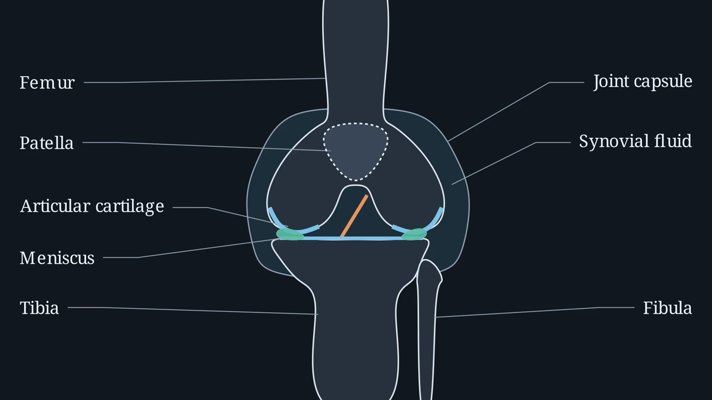

# Manim diagram video generator

This pipeline takes a branching scenario script and produces one narrated
diagram video per scene, plus a manifest describing how the scenes connect. It
writes Manim code with an LLM, renders it, repairs it when the render fails, and
critiques the layout of what came out.

The other half of the video system is the local Wan 2.2 character video pipeline,
documented in [`../README.md`](../README.md). The two are independent and consume
the same script JSON.

## What the output looks like

A knee anatomy explainer, 1080p60, 89 seconds, narrated with Kokoro TTS.

[](https://github.com/darshons/Openstax-Undergrads/blob/main/demo_manim_video/knee_explainer_1080p.mp4)

Click the frame to play it. Source:
[`examples/knee_explainer.py`](../../../examples/knee_explainer.py), video at
[`demo_manim_video/knee_explainer_1080p.mp4`](../../../demo_manim_video/knee_explainer_1080p.mp4).

One caveat, stated plainly because it matters for what you should expect. The
geometry in that clip is **hand authored**, not generated. Every bone is a smooth
closed path through hand-placed anchors, which is why the condyles, tibial plateau
and intercondylar notch read as anatomy. The same scenario run through the full
automatic pipeline produced a recognizable but much cruder diagram, boxes and arcs
roughly in the right places, which you can see at
`output/manim_runs/oa_knee_demo/scenes/scene_1/scene_1.mp4`.

That gap is the honest state of things. The pipeline is reliable at flowcharts,
labeled relationships, graphs, and process diagrams, which is most of what a
scenario needs. It is weak at anatomically faithful figures, where an LLM writing
Manim tends to reach for primitives. `geometry_author.py` is unfinished work
aimed at closing that gap by iterating on a still frame until the shape is right
before any animation is written.

<!-- To embed a video that plays inline in the page rather than linking out,
     edit this file on GitHub and drag the mp4 into the editor. GitHub uploads it
     and leaves a https://github.com/user-attachments/... link, which is the only
     form that autoplays inline. A committed file linked by path cannot do that,
     because GitHub serves repo files as application/octet-stream. -->

## Diagrams, not people

This is the design decision that everything else follows from. Manim renders
people badly. Rather than fight that, this pipeline only ever produces
diagrammatic visuals in the 3Blue1Brown style: flowcharts, labeled figures,
graphs, relationship diagrams. Characters in the scenario are spoken about in the
narration; they are never drawn.

That is why the project has two video pipelines instead of one. When a scenario
needs to show a nurse talking to a patient, that goes to the Wan pipeline. When it
needs to show how glucose metabolism works, it comes here. Both read the same
script JSON, so a scenario can be rendered either way without editing the script.

## What comes out

For a run with request id `demo`:

```
output/manim_runs/demo/
  asset_kit/
    assets.py              the frozen style kit for this scenario
    lineup_snapshot.png    test frame showing every asset
    lineup_grid.png        the same frame with the 6x6 grid overlaid
  scenes/scene_1/
    plan.txt               the planner's beats, occupancy table, narration table
    code/
      scene_1_v0.py        every version, in order
      scene_1_v1.py        a repair attempt or a critic fix
      scene_1_v0_error.log the stderr that caused the next version
      assets.py            copied in so the scene imports the frozen kit
      kokoro_voiceover.py  copied in so the scene can speak
      manim.cfg
    snapshot_v0.png        frame pulled for the layout critic
    grid_v0.png            the same frame with the grid drawn on it
    media/                 Manim's own render tree
    scene_1.mp4            the finished scene
  golden_path.mp4          correct answers only, stitched
  manifest.json            the branch graph
  status.json              live progress, rewritten at every transition
  generation_log.jsonl     one JSON object per event
  run_context.json         inputs needed to regenerate a single scene later
```

The versioned code files are worth knowing about. Every repair attempt and every
critic fix is written as a new file rather than overwriting, so when a scene comes
out wrong you can read the whole history of what the model tried and why the
render failed.

## Setup

```bash
python -m venv .venv && source .venv/bin/activate
pip install -r BackEnd/Video_Generation_Pipeline/manim_generator/requirements.txt
python -m manim_generator.api_kb    # build the Manim API knowledge base
```

Requirements are pinned to versions validated against Manim 0.18.1. Two pins are
load bearing and should not be casually bumped: `setuptools==81.0.0`, because
manim-voiceover 0.3.7 imports `pkg_resources` which setuptools 83 removed, and
`manim==0.18.1`, because the generated code and the API knowledge base are both
written against that API surface.

Kokoro TTS model files are not vendored. Point the environment at them:

```
KOKORO_MODEL_PATH=/abs/path/to/kokoro-v0_19.onnx
KOKORO_VOICES_PATH=/abs/path/to/voices.bin
GEMINI_API_KEY=...
```

For the API server these go in `BackEnd/backend.env`. For the CLI, any `.env`
walking up from the working directory is read.

`manim` must resolve to this venv for both the API process and the render
subprocesses. The pipeline invokes `sys.executable -m manim`, so activating the
venv is enough.

## Running it

```bash
PYTHONPATH=BackEnd/Video_Generation_Pipeline python -m manim_generator.cli \
  --script BackEnd/Script_Generation_Pipeline/_Script_Outputs/output_script_with_decision_points_anthropic_new.json \
  --out output/manim_runs \
  --request-id demo \
  --quality m
```

| Flag | Default | What it does |
|---|---|---|
| `--script` | required | Path to the scenario script JSON |
| `--out` | `output` | Output root |
| `--request-id` | timestamped | Run id, becomes the output subdirectory |
| `--quality` | `m` | `l` 480p15, `m` 720p30, `h` 1080p60 |
| `--model` | `gemini-2.5-pro` | LLM for planning, codegen, and critique |
| `--no-golden` | off | Skip stitching the correct-path preview |

Use `--quality l` while iterating. A full 8 scene scenario takes roughly 30 to 60
minutes, dominated by LLM calls and serial renders rather than by Manim itself.
The CLI exits 0 only if every scene rendered.

## How a run works

A run has three stages: build the asset kit once, then render each scene against
it, then stitch and write the manifest.

### Stage 1, the asset kit

Before any scene is generated, one LLM call produces an `assets.py` for the whole
scenario: a color palette, a 6x6 grid helper, and constructors for the pieces
every scene reuses (`build_background`, `title_card`, `caption`, `label`,
`emphasis_box`), plus a voice map assigning a Kokoro voice per character.

That file is then rendered on its own as an `AssetLineup` scene, which draws every
asset on one frame. The frame is sent back to the model for critique. Once it
passes, the kit is frozen and copied into every scene's code directory.

The point is visual consistency. If each scene invented its own colors and text
sizes, an 8 scene scenario would look like 8 different videos. Freezing the kit
first means every scene imports the same constructors, so consistency is
structural rather than something the model has to remember eight times.

The kit is a single point of failure, so it gets a generous repair budget
(`ASSET_KIT_MAX_REPAIRS = 7`) and there is a hand written parameterized fallback
kit in `asset_kit.build_fallback_kit()`. A bad generation slows a run down; it
cannot hard block it.

### Stage 2, per scene

Scenes render **serially**. This is not a performance oversight. Parallel Manim
subprocesses deadlock, so the API runs the pipeline in a one worker executor.

Each scene goes through four steps.

**Plan.** One LLM call produces three sections: `<BEATS>` (what happens, in
order), `<OCCUPANCY_TABLE>` (which 6x6 grid cells each element occupies), and
`<DIALOGUE_TABLE>` (narration text with its voice). The occupancy table is what
the layout critic later checks against, so the plan is not just a prompt for the
next step, it is the specification the output gets judged on.

Narration length is pre-budgeted here. `prompt_builder.estimate_tts_seconds()`
assumes 2.7 words per second, so the planner knows how much narration fits the
scene's target duration instead of writing text that overruns the animation.

**Generate.** A second LLM call writes a Manim `VoiceoverScene` subclass that
imports the frozen `assets.py` and speaks through the Kokoro service.

**Render and repair.** The code is rendered. If it fails, the ScopeRefine loop
takes over, described below.

**Critique.** After a successful render, a frame is pulled from the video, the
6x6 grid is drawn on top of it, and that image goes back to the model along with
the occupancy table from the plan. The model either returns `<LGTM>` or returns
fixed code, which is re-rendered. Up to 2 rounds.

The critic is deliberately forced to run at least once. In the TheoremExplainAgent
version this was ported from, the critic only fired after a render failure, which
meant scenes that compiled on the first try shipped without anyone looking at
their layout. Those are exactly the scenes where a diagram is quietly overlapping
its own caption.

If the critic's fix breaks the render, the run keeps the last good video and logs
`grid_critic_regressed` rather than losing the scene.

### Stage 3, manifest and golden path

`compute_golden_path()` walks the branch graph following only correct answers.
Those scenes are stitched into `golden_path.mp4`, which is the preview an editor
actually watches. `manifest.json` records the full graph:

```json
{
  "request_id": "e2e_verify_0730",
  "title": "Limiting Reactants in a Nutshell",
  "learning_goal": "Identify the limiting reactant in a simple stoichiometry problem.",
  "scenes": [
    {"scene_id": 1, "type": "narrative", "file": "/abs/path/scene_1.mp4",
     "duration_actual_s": 15.93, "routes_to": {"type": "scene", "scene_id": 2}},
    {"scene_id": 2, "type": "narrative", "file": "/abs/path/scene_2.mp4",
     "duration_actual_s": 18.07, "routes_to": null}
  ],
  "decision_points": [],
  "golden_path": [1, 2],
  "golden_path_video": "/abs/path/golden_path.mp4"
}
```

`duration_actual_s` is probed from the rendered file, not taken from the script's
requested duration. Narration timing shifts the real length, and any player
sequencing these clips needs the measured value.

`validate_manifest_against_script()` checks the manifest back against the original
script and returns a list of problems, which is the hook to use if you want to
gate publishing on a complete render.

## ScopeRefine, the repair loop

LLM generated Manim fails to render often enough that repair is the core of this
pipeline, not an edge case. Handing the whole file back to the model with the
error is slow, expensive, and tends to rewrite working code. ScopeRefine escalates
instead, in `repair.py`:

1. **Line scope.** Find the failing line from the traceback, take 3 lines of
   context each side, ask for a fix to just that region. 2 attempts.
2. **Block scope.** Widen to the enclosing indentation block. 2 attempts.
3. **Full scope.** Only now hand over the whole file.

Each level re-renders before escalating. The outer loop in `pipeline.py` runs this
whole ladder up to 7 times (`MAX_SCENE_REPAIRS`).

Three guards keep the repair from making things worse:

- A replacement that grows the region more than 3x is rejected as a runaway fix
  and escalates instead of being applied.
- A replacement that does not parse is rejected and retried, without poisoning the
  working copy.
- Every candidate is checked with `ast.parse` before it is written.

Two techniques feed the repair prompt:

**Truncated logs.** Manim's Rich traceback is verbose and box drawn. The final
exception is at the very bottom, but the frame pointing into the scene file can be
far above it. `truncate_error_log()` keeps a window around the scene file frame
plus the last 12 lines, joined with `(...)` markers. The model sees both where it
broke and what the exception was, without paying for the whole dump.

**API grounding.** `api_kb.py` introspects the installed Manim and builds
`manim_api_kb.json`, mapping class and method names to real signatures and first
doc lines. Before a repair call, the failing region is scanned for Manim
identifiers and the matching real signatures are injected into the prompt. This
targets the most common failure by far, which is the model inventing a plausible
argument that does not exist. The KB is gitignored and rebuilt from whatever Manim
is installed, so it cannot drift from the version actually rendering.

## Narration

`kokoro_voiceover.py` implements a manim-voiceover `SpeechService` backed by
Kokoro ONNX, so scenes use the standard `with self.voiceover(text=...) as tracker:`
pattern and animations can be timed against `tracker.duration`.

Voices are assigned per character by the asset kit and read back out with
`extract_voice_map()`. Kokoro runs locally on CPU, so narration costs nothing and
needs no network. Audio is cached by content hash, so re-rendering a scene after a
visual only fix does not regenerate speech.

Defaults are environment overridable: `KOKORO_DEFAULT_VOICE` (`af_sarah`),
`KOKORO_DEFAULT_SPEED` (1.0), `KOKORO_DEFAULT_LANG` (`en-us`).

## The 6x6 grid

Layout is expressed on a fixed grid, columns 1 to 6 and rows A to F, covering the
Manim frame from x -5.9 to 5.9 and y 3.3 to -3.3. `grid_to_point("C3")` returns
scene coordinates.

The grid exists so that layout can be checked. The planner declares occupancy in
grid cells, the generated code positions things with `grid_to_point`, and the
critic sees a rendered frame with the same grid drawn over it next to the declared
occupancy table. Without a shared vocabulary the critic can only say "this looks
crowded"; with one it can say that the label meant for D2 is sitting in C2 on top
of the diagram.

## API

```
POST /instructor_api/generate_manim_videos   {script, request_id}
    -> {"status": "started", "request_id": "..."}
       422 if the branch graph is inconsistent, checked before the job starts

GET  /instructor_api/manim_video_status/{request_id}
    -> {state, completed_scenes, failed_scenes, manifest?, error?}
       state: queued | assets | scene_k_of_n | stitching | done | error

GET  /instructor_api/video/{path}
    -> the mp4
```

The job runs in a one worker executor because renders must be serial. Status is a
file read of `status.json`, which the pipeline rewrites at every transition, so
progress survives an API restart and nothing is held in process memory.

The frontend `VideoPage` polls status every 5 seconds and fills in scene cards as
clips complete.

`MANIM_OUTPUT_ROOT` is anchored at the repo root so the output directory is the
same whether the pipeline was launched by the API with cwd `BackEnd/` or by the
CLI from the repo root.

## Regenerating one scene

`regenerate_scene()` re-runs a single scene without touching the rest. It reloads
`run_context.json` and the frozen asset kit from disk rather than regenerating
them, so a regenerated scene still matches its siblings visually.

It optionally takes `plan_override` or `code_override`. A plan override skips the
planner; a code override skips codegen as well and renders the user's own Manim
source. This is the hook for an editor who wants to hand fix one scene rather than
reroll it. Version numbering continues from where the scene left off instead of
restarting at v0, so the original attempts stay readable next to the new ones.

`assets_index.py` lists everything a run produced with a role label, which is what
lets the UI expose plans, code, snapshots, and logs per scene rather than only the
final mp4.

## Module reference

| File | What it holds |
|---|---|
| `pipeline.py` | Run orchestration, `render_scene`, `regenerate_scene` |
| `script_adapter.py` | Script JSON into typed `ScenarioSpec`, branch graph validation |
| `asset_kit.py` | Generate, critique, and freeze `assets.py`; fallback kit |
| `scene_planner.py` | The beats, occupancy, and narration planning call |
| `code_generator.py` | Codegen, code extraction from responses, grid self reflection |
| `repair.py` | ScopeRefine line, block, full escalation with sanity guards |
| `video_renderer.py` | Manim subprocess, log truncation, failing line extraction, snapshot, stitch, duration probe |
| `api_kb.py` | Build and query the Manim API knowledge base |
| `grid_overlay.py` | Draw the 6x6 grid on a frame, cell to coordinate mapping |
| `manifest.py` | Golden path, manifest build, validation against the script |
| `kokoro_voiceover.py` | Kokoro ONNX `SpeechService` |
| `prompt_builder.py` | Prompt assembly, TTS length budgeting |
| `gemini_client.py` | Gemini with retry on codes 8, 13, 14, 429, 500, 503 |
| `llm_client.py` | Claude Code CLI client, the keyless alternative |
| `assets_index.py` | List a run's artifacts with role labels for the UI |
| `logging_utils.py` | `RunStatus`, `status.json`, `generation_log.jsonl` |
| `geometry_author.py` | Iterative still-frame geometry authoring, aimed at anatomically faithful figures. Unfinished, not wired in. |

Prompts live in `prompts/` as plain text files, one per call site. Editing
pipeline behavior usually means editing a prompt there, not Python.

## Tuning

| Constant | Where | Default |
|---|---|---|
| `MAX_SCENE_REPAIRS` | `pipeline.py` | 7 |
| `MAX_CRITIC_ROUNDS` | `pipeline.py` | 2 |
| `ASSET_KIT_MAX_REPAIRS` | `asset_kit.py` | 7 |
| `LINE_ATTEMPTS`, `BLOCK_ATTEMPTS` | `repair.py` | 2, 2 |
| `LINE_CONTEXT` | `repair.py` | 3 |
| `MAX_REPLACEMENT_GROWTH` | `repair.py` | 3.0 |
| `ERROR_LOG_TAIL_LINES` | `video_renderer.py` | 12 |
| `TTS_WORDS_PER_SECOND` | `prompt_builder.py` | 2.7 |

## Known limits

**Serial rendering.** Parallel Manim subprocesses deadlock, so an 8 scene run is
8 sequential renders. Scaling means separate processes with separate media
directories, or separate machines, not threads.

**Cost is in the LLM calls.** A scene costs one planning call, one codegen call,
up to 7 repair rounds of up to 5 calls each, and up to 2 critic calls. A scene
that generates cleanly is 3 calls; a scene that fights back can be 20. Rendering
itself is free.

**No motion critique.** The critic looks at one still frame per round. It catches
overlap and misplacement, and it cannot catch something that only looks wrong
while it moves, like an element that animates in over a label and then off again.

**Model dependence.** Prompts are tuned for Gemini 2.5 Pro. `llm_client.py`
provides a Claude Code CLI path that needs no API key, and swapping models means
retuning prompts, particularly the code extraction pattern and the `<LGTM>` and
`<FIXED_LINES>` markers the pipeline greps for.

**Diagrams only.** Stated at the top and repeated here because it is the most
common thing people expect and do not get. If a scene needs a person on screen, it
belongs in the Wan pipeline.

## Where this came from

The render, repair, and grid critic core is ported from the TheoremExplainAgent
OpenStax fork. The additions here are ScopeRefine escalation, RITL truncated error
logs, API knowledge base grounding for repair, the occupancy table critic, TTS
pre-budgeting, and the forced critic pass. Those came out of a survey of published
LLM to Manim work, and each one targets a specific failure that showed up in
practice.
